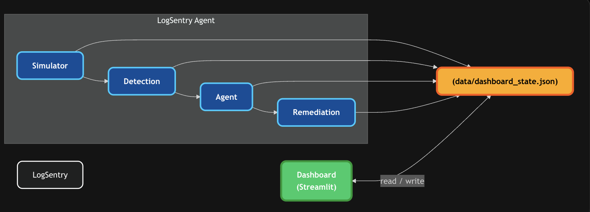

# LogSentry Agent — Architecture

## Overview

LogSentry is an AIOps pipeline that monitors simulated financial microservices, detects anomalies using a statistical + ML ensemble, diagnoses root causes with a ReAct LLM agent, and automatically remediates incidents with safety guardrails.

---

## System Diagram



---

## Simulated Service Topology

Four interdependent FCT (Financial Crime & Technology) microservices:

```
transaction-validator
    ├── fraud-check-service
    │       └── title-search-service  (shared leaf)
    └── document-processor
            └── title-search-service  (shared leaf)
```

Faults injected into `title-search-service` cascade upstream — the most
interesting scenario for testing the agent's dependency-graph reasoning.

---

## Components

### 1. Simulator (`src/simulator/`)

Generates a synthetic but realistic microservice environment.

| File | Responsibility |
|------|---------------|
| `metrics_generator.py` | Produces CPU, memory, latency, error rate, request rate, and connection metrics per service on a configurable interval. Metrics are Gaussian random walks around service-specific baselines. |
| `log_generator.py` | Streams structured JSON log entries (timestamp, level, service, message) at configurable rates per level (INFO 80%, WARNING 15%, ERROR 5%). |
| `fault_injector.py` | Injects fault scenarios by overriding MetricsGenerator baselines and LogGenerator service states. Supports: `crash`, `latency_spike`, `connection_failure`, `memory_leak`, `oom`. Faults expire after a configurable duration. |

### 2. Detection (`src/detection/`)

A four-stage pipeline that converts raw signals into anomaly scores.

| File | Responsibility |
|------|---------------|
| `log_parser.py` | Mines structured log templates from raw log lines using the **Drain** algorithm. Extracts error rates and template frequency features. |
| `feature_extractor.py` | Builds time-windowed multivariate feature vectors from metric snapshots. Computes the **ensemble score**: `0.4 × stat_score + 0.6 × ml_score`. Triggers anomaly if ensemble score ≥ 0.5. |
| `statistical_detector.py` | Per-metric **Z-score** detection over a rolling window. Flags metrics that deviate more than `z_score_threshold` standard deviations from the rolling mean. |
| `ml_detector.py` | Per-service **Isolation Forest** trained on warm-up feature vectors. Scores new observations; raw IF scores (negative = anomalous) are normalised to [0, 1] via sigmoid. |

**Ensemble logic:**
```
ensemble_score = 0.4 × z_score_signal + 0.6 × isolation_forest_score
is_anomaly     = ensemble_score ≥ 0.5
```

### 3. Agent (`src/agent/`)

An LLM-powered ReAct agent that reasons about anomalies and plans remediation.

| File | Responsibility |
|------|---------------|
| `prompts.py` | Builds all LLM prompts: system role, observe (anomaly context), think (reasoning step), act (action request), RCA report. Formats messages for OpenAI and Anthropic APIs. |
| `action_planner.py` | Parses free-form LLM output into validated Pydantic action models: `RestartAction`, `ScaleAction`, `RollbackAction`, `AlertAction`, `NoAction`. Uses brace-depth JSON extraction. |
| `react_agent.py` | Orchestrates the **Observe → Think → Act** loop (up to `max_reasoning_steps`). After the loop, makes a final LLM call to produce a structured RCA report. Supports OpenAI and Anthropic providers. |

**ReAct loop:**
```
Observe (anomaly context)
  └─▶ Think (step 1..N)
        └─▶ Act (parse + execute action)
              └─▶ Observe (execution result)
                    └─▶ ... repeat or terminate
                          └─▶ RCA report (final LLM call)
```

### 4. Remediation (`src/remediation/`)

Translates agent decisions into simulator state changes, with safety limits.

| File | Responsibility |
|------|---------------|
| `guardrails.py` | Enforces per-service restart limits, cooldown windows, and failure-based escalation thresholds before any action executes. |
| `executor.py` | Dispatches validated actions to handler methods. Each handler manipulates the FaultInjector or MetricsGenerator and returns an `ExecutionResult` that becomes the agent's next Observation. |

**Supported actions:**

| Action | Effect |
|--------|--------|
| `restart_service` | Clears active faults, restores baseline metrics |
| `scale_service` | Records replica count change (no physical resources) |
| `rollback_service` | Same as restart in simulation |
| `alert_on_call` | Logs P1/P2/P3 alert to terminal and dashboard |
| `no_action` | Records the decision; terminates the ReAct loop |

### 5. Dashboard (`src/dashboard/`)

A live Streamlit web UI that visualises all pipeline activity.

| Panel | Content |
|-------|---------|
| Service Health | Colour-coded status cards (healthy / degraded / down) with current metrics |
| Metrics Charts | Plotly rolling time-series per service (CPU, memory, latency, error rate, req/s) with anomaly markers |
| Log Stream | Scrolling colour-coded log table (red = ERROR/CRITICAL, yellow = WARNING) |
| Anomaly Alerts | Alert cards with service, score, triggered metrics, and timestamp |
| Agent Trace | Expandable Thought → Action → Observation steps + final RCA JSON |
| Remediation Log | Table of all executed actions with outcome and guardrail decisions |

**State sharing:** The pipeline writes `data/dashboard_state.json` after every tick. The dashboard reads this file on every 2-second refresh — no shared memory required.

### 6. Pipeline Orchestrator (`src/main.py`)

Wires all components and runs the main loop.

```
startup
  └─▶ warm-up (20 rounds of normal metrics → train Isolation Forest)
        └─▶ detection loop (every 5 seconds)
              ├─▶ advance fault injector (expire timed-out faults)
              ├─▶ generate metric snapshots (one per service)
              ├─▶ statistical detection
              ├─▶ ML detection
              ├─▶ compute ensemble score
              ├─▶ if anomaly → invoke ReAct agent → execute actions
              └─▶ write dashboard state to disk
```

---

## Configuration

All tuneable parameters are in `config/config.yaml`:

```yaml
simulator:
  metrics_interval_seconds: 5   # tick rate

detection:
  z_score_threshold: 3.0        # statistical sensitivity
  isolation_forest:
    contamination: 0.1          # expected anomaly rate
  ensemble_weights:
    statistical: 0.4
    ml: 0.6

agent:
  llm_provider: "openai"        # or "anthropic"
  model: "gpt-4o-mini"
  max_reasoning_steps: 5

remediation:
  max_restarts_per_service: 3
  restart_cooldown_seconds: 300
  auto_escalate_after_failures: 2
```

---

## Data Flow

```
MetricsGenerator ──▶ StatisticalDetector ──▶ ensemble score ──▶ ReActAgent
                  └▶ FeatureExtractor    ──▶               └──▶ Executor ──▶ FaultInjector
                                                                         └──▶ Guardrails
LogGenerator      ──▶ LogParser          ──▶ log features

All components ──▶ _save_dashboard_state() ──▶ data/dashboard_state.json ──▶ Streamlit
```

---

## Tech Stack

| Layer | Technology |
|-------|-----------|
| Language | Python 3.11+ |
| ML / Detection | scikit-learn, numpy, scipy, pandas |
| Log Parsing | drain3 |
| LLM | OpenAI GPT-4o-mini or Anthropic Claude |
| Dashboard | Streamlit + Plotly |
| Config | PyYAML + Pydantic |
| Testing | pytest |
